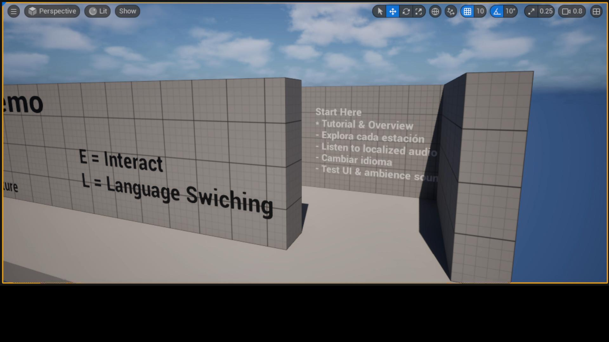
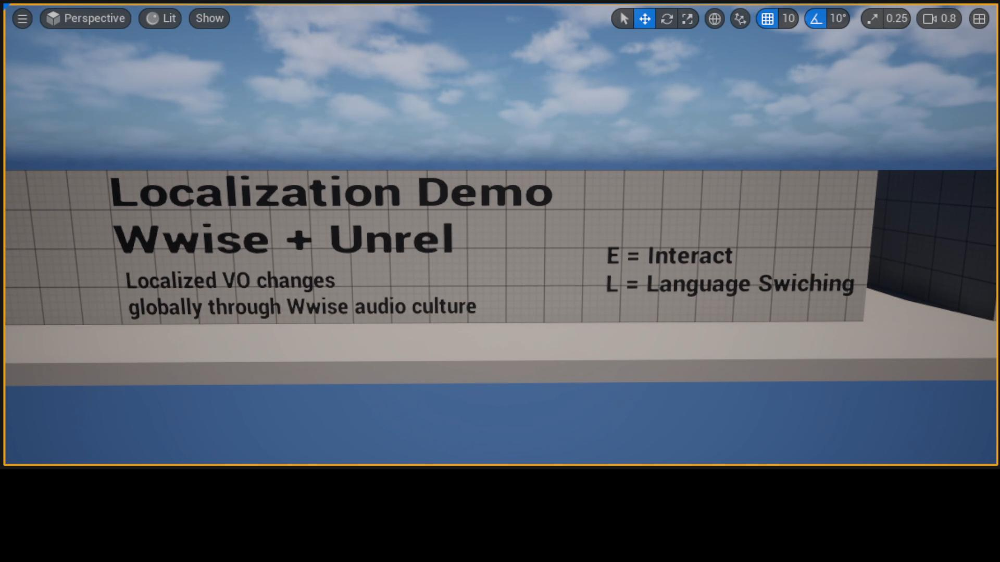
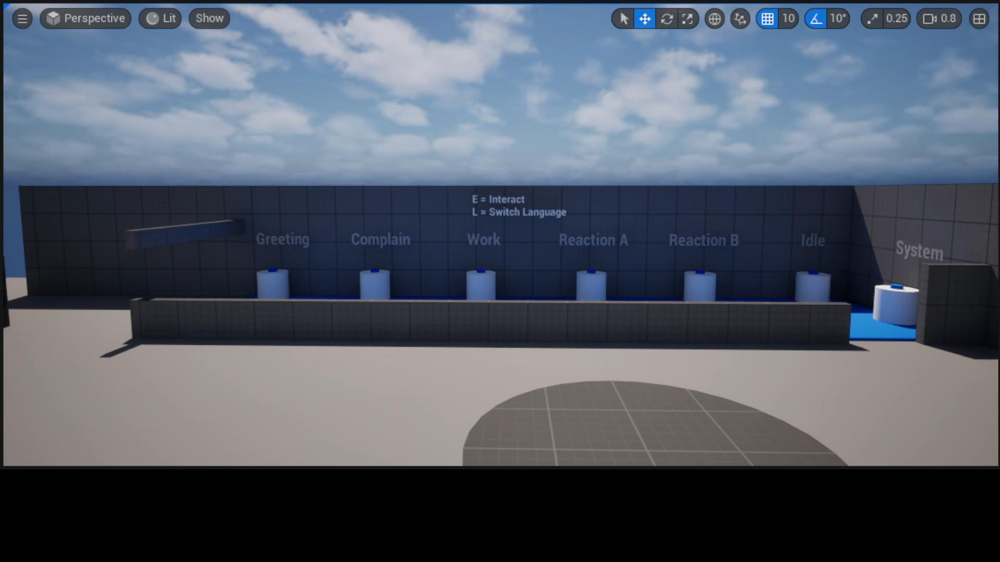
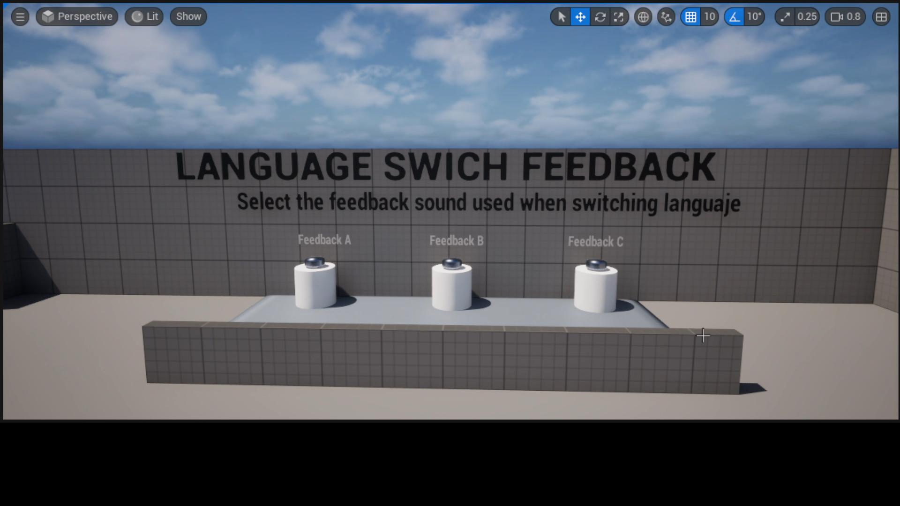
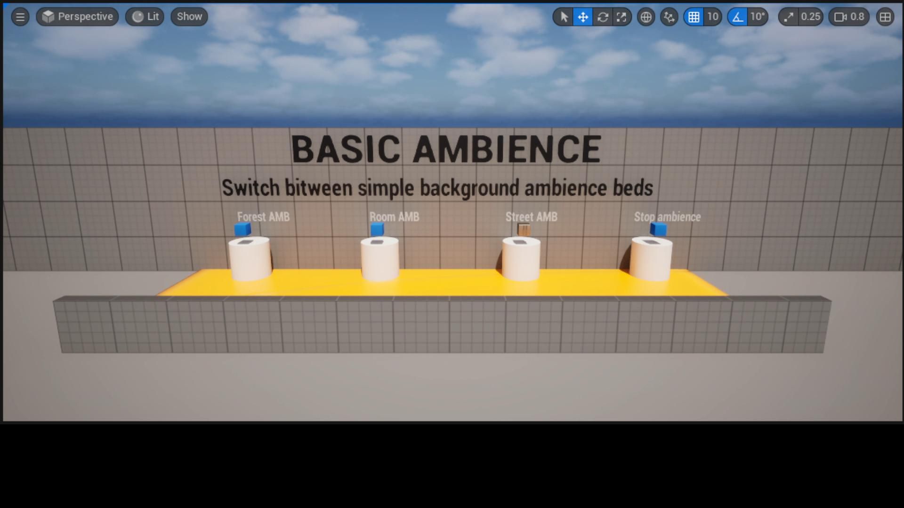
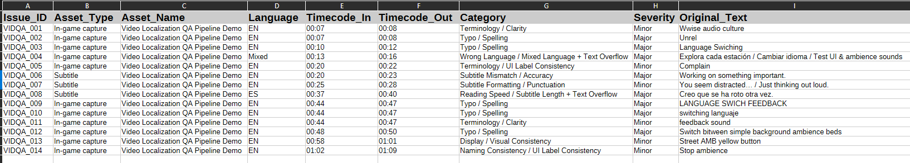
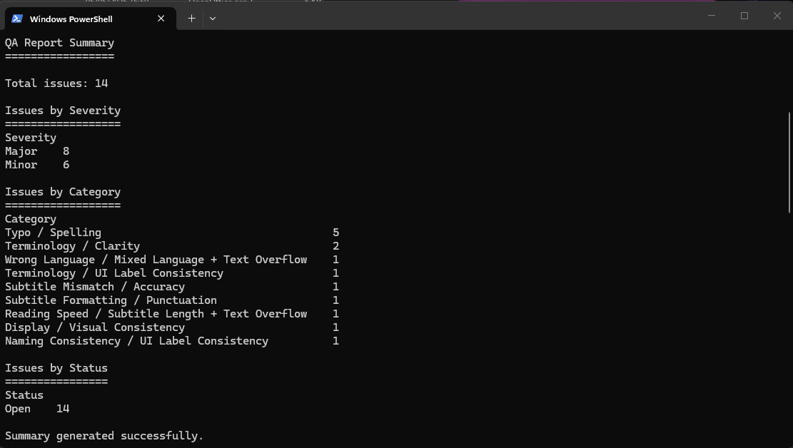
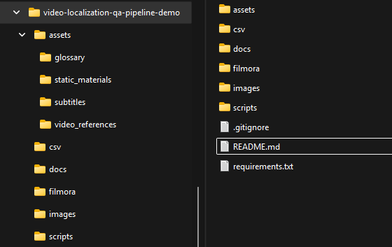

# Video Localization QA Pipeline Demo

A portfolio project demonstrating a video localization QA workflow for game and interactive media content.

This project focuses on identifying, documenting, and reporting localization issues in a short video demo, using subtitles, QA documentation, a glossary, Python validation scripts, and a structured QA report.

## Project Overview

The goal of this project is to simulate a practical localization QA pipeline for video/game content.

The demo includes:

- EN/ES subtitle files
- Localization QA checklist
- Subtitling guidelines
- Issue severity guide
- QA workflow documentation
- Sample QA report in CSV format
- Python scripts for subtitle validation and QA summary generation
- Screenshots for visual documentation

This project was created as part of my transition into localization QA, audio localization, and technical QA workflows for games.

## Screenshots

### Intro Panel in Unreal



### Unreal Demo Overview



### Title and Terminology Issues



### Language Switch Feedback Typo



### Basic Ambience UI Issues



### QA Report CSV



### Python QA Summary



### Project Structure



## Key Skills Demonstrated

- Localization QA
- Subtitle QA
- EN/ES linguistic review
- Bug reporting
- QA documentation
- Glossary usage
- Reading speed checks
- Python scripting for QA support
- Structured CSV reporting
- Video review workflow
- Attention to UI, subtitle, terminology, and consistency issues

## Project Structure

```text
video-localization-qa-pipeline-demo/
|
|-- assets/
|   |-- glossary/
|   |   |-- glossary_en_es.csv
|   |
|   |-- subtitles/
|   |   |-- video_qa_sample_en.srt
|   |   |-- video_qa_sample_es.srt
|   |
|   |-- video_references/
|       |-- video_links.md
|
|-- csv/
|   |-- qa_report_sample.csv
|
|-- docs/
|   |-- issue_severity_guide.md
|   |-- localization_qa_checklist.md
|   |-- qa_workflow.md
|   |-- script_test_results.md
|   |-- subtitling_guidelines.md
|   |-- video_qa_plan.md
|   |-- video_script_and_issues.md
|
|-- images/
|
|-- scripts/
|   |-- 01_validate_srt_structure.py
|   |-- 02_check_subtitle_reading_speed.py
|   |-- 03_generate_qa_summary.py
|
|-- .gitignore
|-- README.md
|-- requirements.txt
```

## QA Scope

The QA review covers several types of localization and presentation issues:

- Spelling mistakes
- Typos
- Terminology inconsistencies
- Mixed language issues
- Subtitle/audio mismatch
- Text overflow
- UI display problems
- Reading speed issues
- Visual consistency issues
- Naming consistency issues

## Example Issues Covered

The sample QA report includes intentional issues such as:

- Incorrect spelling in UI text
- Mixed English and Spanish UI content
- Subtitle text overflowing the screen
- Subtitle/audio mismatch
- Incorrect terminology
- Inconsistent button naming
- Visual inconsistency in UI buttons
- Long subtitles affecting readability

## Python Scripts

The project includes small Python scripts to support the QA workflow.

### 01_validate_srt_structure.py

Validates the basic structure of the subtitle files.

It checks:

- Subtitle index format
- Timecode structure
- Empty lines
- General SRT formatting

### 02_check_subtitle_reading_speed.py

Checks subtitle reading speed and helps identify lines that may be too long or difficult to read comfortably.

### 03_generate_qa_summary.py

Generates a summary from the QA report CSV file.

This helps quickly review the number and type of issues found during the QA pass.

## Requirements

Install dependencies with:

```bash
pip install -r requirements.txt
```

Current dependencies:

```text
pandas
openpyxl
srt
```

## How to Run the Scripts

From the project root, run:

```bash
python scripts/01_validate_srt_structure.py
python scripts/02_check_subtitle_reading_speed.py
python scripts/03_generate_qa_summary.py
```

## QA Report

The main QA report is located at:

```text
csv/qa_report_sample.csv
```

It contains sample localization issues with fields such as:

- Timecode
- Category
- Issue type
- Severity
- Current text
- Expected result
- Notes

## Video Reference

The edited video file is not included in the repository because of file size and version-control best practices.

Video reference information can be found in:

```text
assets/video_references/video_links.md
```

## Notes

Large media files and editing project files are excluded from the repository through `.gitignore`.

This includes:

- Video files
- Audio files
- Filmora project files
- Render/export folders
- Temporary files

## About

Created by Pablo Flores Alosi.

Portfolio: https://pablofalosi.wixsite.com/home  
LinkedIn: https://www.linkedin.com/in/pablofloresalosi/  
GitHub: https://github.com/PabloFloresAlosi
